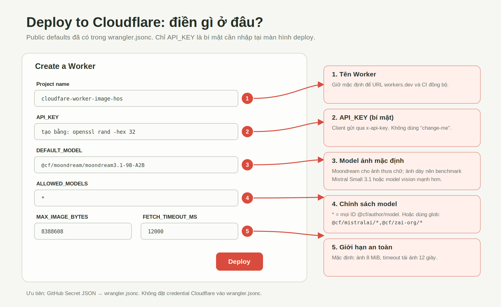
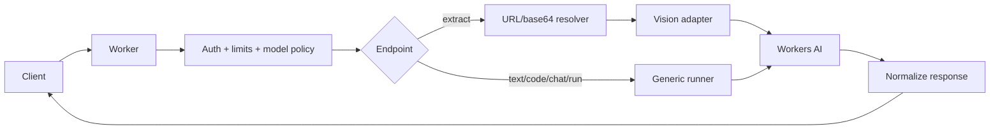

# Cloudflare Worker Image HOS + Workers AI Gateway

[](https://deploy.workers.cloudflare.com/?url=https://github.com/oh250515-ai/cloudfare-worker-image-hos)

A globally deployed Cloudflare Worker for image extraction, text, code, chat and raw Workers AI inference.

## Hướng dẫn điền tham số khi Deploy



> Public defaults đã có trong `wrangler.jsonc`. Trên màn hình deploy, quan trọng nhất là đổi `API_KEY` thành chuỗi mạnh. Không dùng `change-me`.

### Giá trị khuyến nghị

| Trường | Giá trị / cách chọn |
| --- | --- |
| Project name | Giữ `cloudfare-worker-image-hos` nếu muốn CI và URL đồng bộ |
| `API_KEY` | Tạo bằng `openssl rand -hex 32`; client gửi qua `x-api-key` |
| `DEFAULT_MODEL` | Moondream cho ảnh thưa chữ; ảnh dày nên benchmark Mistral Small 3.1 |
| `ALLOWED_MODELS` | `*`, exact ID, comma list hoặc glob như `@cf/mistralai/*` |
| `MAX_IMAGE_BYTES` | `8388608` (8 MiB) |
| `FETCH_TIMEOUT_MS` | `12000` ms |

## Deploy options

### One-click Cloudflare deployment

Click **Deploy to Cloudflare** above. Cloudflare clones the repository, provisions Workers AI and deploys with public defaults from `wrangler.jsonc`. No GitHub credential secret is required because Cloudflare uses its OAuth flow.

### GitHub Actions deployment

Create repository secret `CLOUDFLARE_CONFIG_JSON`, then push to `main`. GitHub Actions tests, audits, deploys, publishes Pages and smoke-tests the API.

## Configuration precedence

```text
CLOUDFLARE_CONFIG_JSON non-empty field
  ↓ fallback
wrangler.jsonc vars
  ↓ fallback
application default where documented
```

Credentials and `apiKey` must remain in GitHub/Cloudflare Secrets, never in `wrangler.jsonc`.

## Public defaults in wrangler.jsonc

```jsonc
{
  "vars": {
    "ALLOWED_MODELS": "*",
    "DEFAULT_MODEL": "@cf/moondream/moondream3.1-9B-A2B",
    "DEFAULT_TEXT_MODEL": "@cf/zai-org/glm-4.7-flash",
    "DEFAULT_CODE_MODEL": "@cf/zai-org/glm-5.2",
    "MAX_IMAGE_BYTES": "8388608",
    "FETCH_TIMEOUT_MS": "12000",
    "TEST_IMAGE_URL": "https://pgurpzubjhgilszrscdl.storage.supabase.co/storage/v1/object/public/o25.ip8plus.0424/public-bucket-proxy/DESKTOP-281KMLH-Arc-2026-07-08-11h35p30.005.png",
    "WORKERS_SUBDOMAIN": "oh25-0515"
  }
}
```

`TEST_IMAGE_URL` and `WORKERS_SUBDOMAIN` are CI helpers and are removed from generated runtime variables.

## Secret JSON overrides

```json
{
  "accountId":"32-character-account-id",
  "apiToken":"scoped-cloudflare-token",
  "apiKey":"runtime-client-key",
  "allowedModels":"@cf/mistralai/*,@cf/zai-org/*",
  "defaultModel":"@cf/mistralai/mistral-small-3.1-24b-instruct",
  "textModel":"@cf/zai-org/glm-4.7-flash",
  "codeModel":"@cf/zai-org/glm-5.2",
  "maxImageBytes":"8388608",
  "fetchTimeoutMs":"12000",
  "testImageUrl":"https://example.com/safe-test.png",
  "workersSubdomain":"oh25-0515"
}
```

If a public field is absent, the `wrangler.jsonc` value is used. Global-key auth can replace `apiToken` with `email` + `apiGlobalToken`.

## Field mapping

| Secret JSON | Wrangler var | Effect |
| --- | --- | --- |
| `allowedModels` | `ALLOWED_MODELS` | Exact IDs, list, globs, or `*` for safe `@cf/author/model` input |
| `defaultModel` | `DEFAULT_MODEL` | Default image model |
| `textModel` | `DEFAULT_TEXT_MODEL` | Default text/chat model |
| `codeModel` | `DEFAULT_CODE_MODEL` | Default code model |
| `maxImageBytes` | `MAX_IMAGE_BYTES` | Maximum image bytes |
| `fetchTimeoutMs` | `FETCH_TIMEOUT_MS` | Remote image timeout |
| `testImageUrl` | `TEST_IMAGE_URL` | CI fixture only |
| `workersSubdomain` | `WORKERS_SUBDOMAIN` | workers.dev prefix only |

## API endpoints

`GET /health`, `GET /v1/models`, `POST /v1/extract`, `POST /v1/text`, `POST /v1/code`, `POST /v1/chat`, `POST /v1/run`.

## Main flow



## Development rules

1. Read `AGENTS.md`, `SPEC.md`, API, deployment, model and security docs before editing.
2. Keep model-specific behavior inside adapters and preserve the response envelope.
3. Never hardcode business fields; callers own prompts and schemas.
4. Never commit credentials or log production image content.
5. Run audit, typecheck and tests before push.

## Links

[API docs](docs/API.md) · [Deployment](docs/DEPLOY.md) · [Models](docs/MODELS.md) · [Vision benchmark](docs/VISION_BENCHMARK.md) · [Changelog](CHANGELOG.md) · [Release v2.1.0](https://github.com/oh250515-ai/cloudfare-worker-image-hos/releases/tag/v2.1.0)
